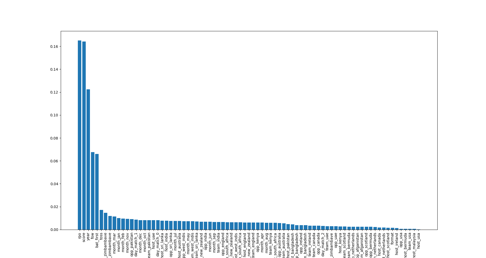
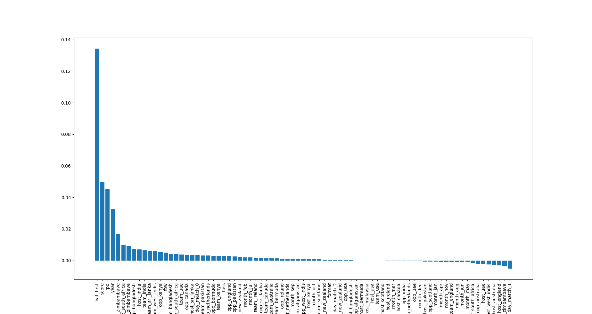

# Cricket Winner Prediction

## Overview
This project explores the predictability of cricket matches by leveraging machine learning techniques. As part of Assignment 3 in a machine learning course at IIT Delhi, the goal was to predict the winner of white-ball matches (ODIs and T20s) based on the first innings score and match metadata.

## Dataset
The dataset was created by scraping data from the ESPN website, encompassing a range of white-ball matches. It includes information such as first innings score, host, toss details, and the year of the match. The scraping script is provides ad `data_generation.py`. To generate data run
```
python data_generation.py
```
It will generate `data_full.csv`. Make appropiate split into train and test. 

## Model and Methodology
The predictive models employed for this task were decision trees and random forests. Using the features from the dataset, the models were trained to forecast the match outcome. We have also provides script to run the random forest baseline as 
```
python baseline.py
```

## Results
Surprisingly, the models achieved an accuracy of close to 75% on the test dataset. This suggests that, after the first innings, we can predict the results of 3 out of 4 matches. Following were the most important feature dependeing on impurity 


## Key Predictors
The crucial predictors in determining match outcomes were found to be the first innings score, runrate, year and batting first or not feature.



And according to permutation the following are feature importance 



## Usage
1. Clone the repository.
2. Install the required dependencies. (python, scikit, matplotlib)
